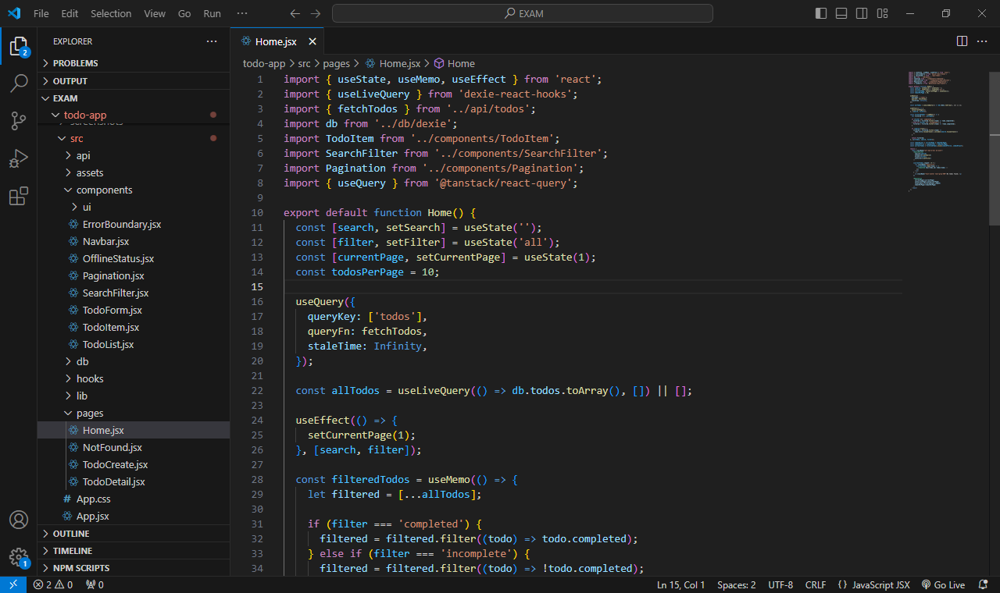
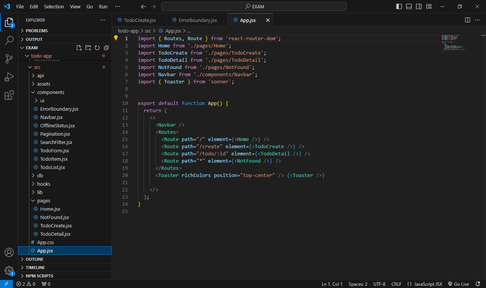
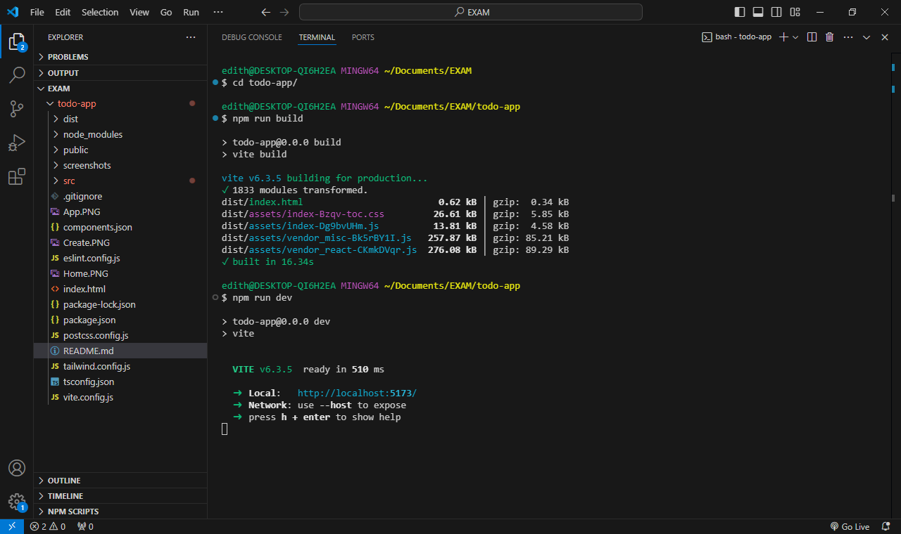

# ✅ React Todo App

A fully functional Todo application built with **React 19**, **React Router v7**, **React Query v5**, **Dexie.js** (for offline support), **Tailwind CSS**, and **ShadCN UI** components. This app showcases professional-grade frontend engineering, including full CRUD, search, filtering, pagination, offline persistence, and accessible UI.

---

## 🚀 Features

- 📝 Create, edit, delete, and view todos
- ✅ Toggle completed/incomplete todos
- 🔍 Search and filter by status
- 📚 Pagination (10 todos per page)
- 🗃️ Offline persistence with IndexedDB (Dexie.js)
- 📡 API integration (JSONPlaceholder)
- 🌐 Online/offline status detection
- ♿ Keyboard accessibility and ARIA compliance
- 🧩 Modular architecture with reusable components
- 💅 Styled with TailwindCSS and ShadCN UI
- 🔔 Toast notifications using `sonner`
- 🛠️ ErrorBoundary and fallback UI

---

## 🛠️ Installation

Clone the project and install dependencies:

```bash
git clone https://github.com/Edith-Anurika-Monday1/todo-x.git
cd todo-app
npm install
```

---

#### ⚡ Vite + React Initialization

```bash
npm create vite@latest todo-app -- --template react
cd todo-app
npm install
```

---
#### ShadCn Add TailwindCSS Installation guide
ShadCn:- a pre-built accessible component library with Utility-first CSS styling, run this command in your terminal (e.g-: bash)

```npm install tailwindcss @tailwindcss/vite```

Replace everything in src/index.css with the following below:

```@import "tailwindcss";```

- To add a component, run this command;

```npx shadcn@latest add component```

always change component with the component name you want to add, for example if you want to add an accordion component your command should be;

```npx shadcn@latest add accordion```

For best clarifications on this [visit the shadCn installation guide documentations](https://ui.shadcn.com/docs/installation)

---
#### Install react router v7

```npm install react-router-dom@7```

also import it after installation and export where necessary (eg: main.jsx or tsx ) depending on the files extension.

```import { createBrowserRouter, RouterProvider } from 'react-router-dom';```

#### TanStack React Query v5

```npm install @tanstack/react-query```

wrap `App` in a QueryClientProvider:

```import { QueryClient, QueryClientProvider } from '@tanstack/react-query';
const queryClient = new QueryClient();

<QueryClientProvider client={queryClient}>
  <App />
</QueryClientProvider>
```

make sure to use version 5 syntax.

---

#### Install 🗃️ Dexie.js (for IndexedDB persistence)

```npm install dexie dexie-react-hooks```

After installation, export and import where necessay.

#### react-hook-form installation
For  form handling/management with validation

```npm add react-hook-form```

export and import properly where you want it used(TodoForm.jsx).

---

#### API Documentation
This project uses `https://jsonplaceholder.typicode.com/todos` as a mock API/ baseUrl to;
- GET /todos – Fetch all todos (limited to 50).
- GET /todos/:id – Fetch a single todo.
- POST /todos – Simulated in Dexie (local only).
- PUT /todos/:id – Update a todo.
- DELETE /todos/:id – Delete a todo.
- Caches to Dexie on first load.
- Uses React Query to manage queries and mutations.


---

📸 Screenshots

### 🏠 Home Page


---


### ➕ Create Todo


---

### 🖼 App


---

### 📜 Terminal Message


---

#### ⚠️ Known Issues
- new todos or deletions only persist in local Dexie storage, Since this app uses JSONPlaceholder (Edits are local and not synced back to JSONPlaceholder).
- No user authentication — all todos are public and mock-based.
- Offline mode limited to local device storage.

---

### 🚧 Future Improvements
- Add user  login and authentication

- Implement drag-and-drop reordering

- Sync Dexie with a real API using background sync / Server-side data persistence with backend.

- Enable Responsive dark/light mode toggle.

- Add animations for transitions and page changes

- Improved error handling and retry logic

- Unit and integration tests

---

#### 🔃 Available Scripts
- npm run dev       # Start local dev server
- npm run build     # Build for production
- npm run preview   # Preview built app

---

#### 🚀 Push Local Project to GitHub Repository

To upload your local project to a GitHub repo (e.g., todo-x):
# Initialize Git (if not already initialized)
git init

# Add all project files
git add .

# Commit with a meaningful message
git commit -m "Initial commit: Set up full React Todo App with Dexie, React Query, Tailwind, and routing..."

# Set the remote origin (replace with your actual GitHub repo link)
git remote add origin https://github.com/Edith-Anurika-Monday1/todo-x.git

# Pull latest changes from remote (to avoid conflicts)
git pull --rebase origin main

# Resolve any merge conflicts if prompted (edit files, then run:)
git add .
git rebase --continue

# Finally, push your local code to GitHub
git push -u origin main
