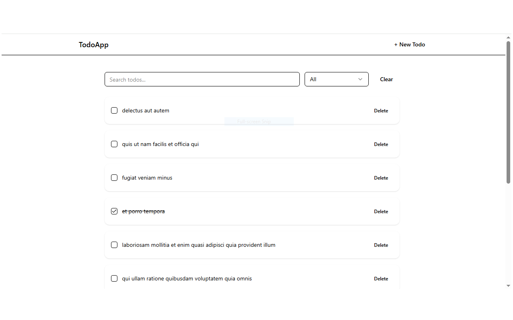
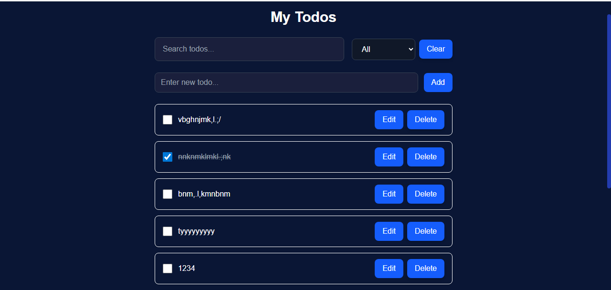

# ✅ React Todo App

A fully functional Todo application built with **React 19**, **React Router v7**, **React Query v5**, **Dexie.js** (for offline support), **Tailwind CSS**, and **ShadCN UI** components. This app showcases professional-grade frontend engineering, including full CRUD, search, filtering, pagination, offline persistence, and accessible UI.

---

### 🚀 Features

- 📝 Create, edit, delete, and view todos
- ✅ Toggle completed/incomplete todos
- 🔍 Search and filter by status
- 📚 Pagination (10 todos per page)
- 🗃️ Offline persistence with IndexedDB (Dexie.js)
- 📡 API integration (JSONPlaceholder)
- 🌐 Online/offline status detection
- ♿ Keyboard accessibility and ARIA compliance
- 🧩 Modular architecture with reusable components
- 💅 Styled with TailwindCSS and ShadCN UI
- 🔔 Toast notifications using `sonner`
- 🛠️ ErrorBoundary and fallback UI

---

### 🛠️ Installation

Clone the project and install dependencies:

```bash
git clone https://github.com/Edith-Anurika-Monday1/todo-x.git
cd todo-app
npm install
```

---

#### ⚡ Vite + React Initialization

```bash
npm create vite@latest todo-app -- --template react
cd todo-app
npm install
```

---
#### ShadCn Add TailwindCSS Installation guide
ShadCn:- a pre-built accessible component library with Utility-first CSS styling, run this command in your terminal (e.g-: bash)

```npm install tailwindcss @tailwindcss/vite```

Replace everything in src/index.css with the following below:

```@import "tailwindcss";```

- To add a component, run this command;

```npx shadcn@latest add component```

always change component with the component name you want to add, for example if you want to add an accordion component your command should be;

```npx shadcn@latest add accordion```

For best clarifications on this [visit the shadCn installation guide documentations](https://ui.shadcn.com/docs/installation)

---
#### Install react router v7

```npm install react-router-dom@7```

also import it after installation and export where necessary (eg: main.jsx or tsx ) depending on the files extension.

```import { createBrowserRouter, RouterProvider } from 'react-router-dom';```

#### TanStack React Query v5

```npm install @tanstack/react-query```

wrap `App` in a QueryClientProvider:

```import { QueryClient, QueryClientProvider } from '@tanstack/react-query';
const queryClient = new QueryClient();

<QueryClientProvider client={queryClient}>
  <App />
</QueryClientProvider>
```

make sure to use version 5 syntax.

---

#### Install 🗃️ Dexie.js (for IndexedDB persistence)

```npm install dexie dexie-react-hooks```

After installation, export and import where necessay.

#### react-hook-form installation
For  form handling/management with validation

```npm add react-hook-form```

export and import properly where you want it used(TodoForm.jsx).

---

#### API Documentation
This project uses `https://jsonplaceholder.typicode.com/todos` as a mock API/ baseUrl to;
- GET /todos – Fetch all todos (limited to 50).
- GET /todos/:id – Fetch a single todo.
- POST /todos – Simulated in Dexie (local only).
- PUT /todos/:id – Update a todo.
- DELETE /todos/:id – Delete a todo.
- Caches to Dexie on first load.
- Uses React Query to manage queries and mutations.


---

📸 Screenshots

### 🏠 Home Page


---


### ➕ Create Todo


---

### 🖼 App


---

### 📜 Terminal Message


---

#### ⚠️ Known Issues

- new todos or deletions only persist in local Dexie storage, Since this app uses JSONPlaceholder (Edits are local and not synced back to JSONPlaceholder).
- No user authentication — all todos are public and mock-based.
- Offline mode limited to local device storage.
- Todos not time regulated.
- Todo item can not be edited.

---

### 🚧 Future Improvements

- Add user  login and authentication.
- Date, time and alarm notifications/sound implementation.
- Implement drag-and-drop reordering.
- Sync Dexie with a real API using background sync / Server-side data persistence with backend.
- Due to one can have swing/change in tasks or schedules, todo item should be made editable.
- Enable Responsive dark/light mode toggle.
- Add animations for transitions and page changes.
- Improved error handling and retry logic
- Nav should include deleted todos page.

---

### 🧩 Challenges Faced During Project Development

Throughout the development of the **Todo-X** project, I encountered and overcame several challenges across setup, development, debugging, and deployment phases. This document outlines all the key issues and how I resolved them.

---

### 🚀 1. Project Setup & Configuration

- **Initial Setup Confusion**  
  I experimented with different React setups like CRA and Vite before deciding on **Vite + React + TypeScript**, which offered better performance and developer experience.

- **TailwindCSS Not Working Initially**  
  TailwindCSS styles were not rendering because of incorrect configuration in `postcss.config.js` and `tailwind.config.js`. Fixing the plugin paths resolved this.

- **ShadCN & Radix UI Integration**  
  Setting up ShadCN UI components and Radix UI correctly required creating proper folder structures, extending Tailwind themes, and setting default styles.

- **TypeScript Errors Everywhere**  
  Several TSX files displayed red squiggly lines due to missing prop types or incorrect component wrappers. I resolved this by explicitly typing props and using `React.ComponentPropsWithoutRef`.

---

### ⚙️ 2. Component Logic & API Management

- **No `useEffect` Usage Preference**  
  I chose to avoid `useEffect`, which made data syncing and query refetching more complex. I used Tanstack Query's built-in mechanisms like `invalidateQueries()` to manage updates.

- **TanStack React Query v5 Migration**  
  React Query v5 uses a different hook syntax from v4. I updated all query and mutation calls to use the new object-based syntax, including `queryFn`, `mutationFn`, and `queryKey`.

- **Dexie.js (Offline Support)**  
  Integrating IndexedDB with Dexie for offline persistence required managing state between remote API and local database. There were issues with `add()` vs `put()` that I later resolved.

- **Button Styling Inconsistencies**  
  Initially, button components had duplicated styles. I later refactored this by creating a `buttonVariants` utility using `class-variance-authority (cva)` to centralize variants.

---

### 💥 3. Functional Bugs & User Experience

- **Checkbox Not Toggling**  
  The checkbox to mark todos as completed wasn't working. I resolved this by ensuring the `onCheckedChange` handler correctly called `toggleMutation.mutate`.

- **Delete Toast Appearing Without Deletion**  
  The toast for "Todo deleted" would show even if the deletion didn't happen. I fixed this by wrapping the delete logic in an `AlertDialog` that asks for user confirmation before proceeding.

- **Search and Filter Not Functioning**  
  The dropdown filter to show completed/incomplete/all todos was broken due to incorrect filter logic. I updated the component to apply filters before rendering.

- **Pagination Not Reflecting Filtered Results**  
  Pagination worked globally but not on filtered results. I fixed this by slicing only the filtered todos array, not the full list.

---

### 🌐 4. Deployment & Hosting on Vercel

- **Blank Page After Deployment**  
  After deploying to Vercel, the app showed a blank screen with this error: Uncaught ReferenceError: Cannot access 'Z' before initialization;
  I traced the issue to a **circular import** between `button.tsx` and `AlertDialog.tsx`. Moving `buttonVariants` to a separate file (`ui/button-variants.ts`) resolved the issue.

- **Favicon and Meta Missing in Production**  
I added missing metadata and favicon in `index.html` to ensure proper branding and SEO.

---

## ⚠️ React Router Future Flag Warning

During development, React Router (v6.23+) displays future warnings in the browser console. 

### 🟡 Warning Messages

#### 1. `startTransition` Warning

⚠️ React Router Future Flag Warning: React Router will begin wrapping state updates in React.startTransition in v7.
You can use the v7_startTransition future flag to opt-in early.


#### 2. `relativeSplatPath` Warning
⚠️ React Router Future Flag Warning: Relative route resolution within Splat routes is changing in v7.
You can use the v7_relativeSplatPath future flag to opt-in early.

Since my project uses BrowserRouter (not RouterProvider or createBrowserRouter),i considered these warnings safe to ignore though its more modern.

---

#### 🔃 Available Scripts
- npm run dev (Start local dev server)
- npm run build (Build for production)
- npm run dev (Preview built app)

---

## 🚀 Push Local Project to GitHub Repository
To upload your local project to a GitHub repo (e.g., todo-x):
#### Initialize Git (if not already initialized)
```bash
git init
```
#### Add all project files
```bash
git add .
```
#### Commit with a meaningful message
```bash
git commit -m "Initial commit: Set up full React Todo App with Dexie, React Query, Tailwind, and routing..."
```
#### Set the remote origin (replace with your actual GitHub repo link)
```bash
git remote add origin https://github.com/Edith-Anurika-Monday1/todo-x.git
```
#### Pull latest changes from remote (to avoid conflicts)
```bash
git pull --rebase origin main
```

#### Resolve any merge conflicts if prompted (edit files, then run:)
```bash
git add .
git rebase --continue
```
#### Finally, push your local code to GitHub
```bash
git push -u origin main
```

---

## 🧩 Migration Summary — React Todo App (JSX → TypeScript)
#### 📘 Overview
This document summarizes the complete migration of the React Todo Application from JavaScript (JSX) to TypeScript (TSX).
The project was originally built using React 19+, React Query v5, Dexie.js, Tailwind CSS, and ShadCN UI, and has now been fully refactored into a TypeScript-safe, type-enforced, and scalable codebase.

### ⚙️ Migration Goals
- The migration aimed to:
- Strengthen type safety and eliminate runtime type errors.
- Improve developer experience through better IntelliSense and autocomplete.
- Make the project easier to scale and maintain.
- Ensure zero functional or visual regressions from the original JSX version.

### 🔧 New Dependencies Added During Migration

  To support TypeScript and ensure smooth operation, several additional dependencies were introduced.

##### Core TypeScript Dependencies

```bash
npm install --save-dev typescript @types/react @types/react-dom
```

##### 🧩 React Query (v5) with Type Safety
```bash
npm install @tanstack/react-query
``` 

##### 💾 Dexie.js (IndexedDB Persistence)

```bash 
npm install dexie
npm install --save-dev @types/dexie
```

##### 🎨 UI Libraries (Tailwind + ShadCN + Sonner)
```bash
npm install tailwindcss postcss autoprefixer
npx tailwindcss init -p

npm install class-variance-authority clsx tailwind-merge
npm install sonner
```

#### 🧭 React Router v7 (Typed Routing)
```bash
npm install react-router-dom
npm install --save-dev @types/react-router-dom
```

### 🔁 Migration Process Summary
#### 🏁 Step 1 — Project Setup
- Initialized a new Vite + React + TypeScript project.
- Configured tsconfig.json for strict typing and path resolution.
- Updated all imports to relative paths (no @ aliases).

### 🧱 Step 2 — File Conversion
- All .jsx files were systematically renamed to .tsx.
- Type definitions (interface and type) were introduced for props, hooks, and API data.

### 🧩 Step 3 — API Layer

- api/todos.js → api/todos.ts
    - Added Todo interface.
    - Ensured proper return types for async API methods.

```tsx
// Before (JSX)
export const getTodos = async () => {
  const res = await fetch("/api/todos");
  return res.json();
};

// After (TSX)
export interface Todo {
  id: number;
  title: string;
  completed: boolean;
}

export const getTodos = async (): Promise<Todo[]> => {
  const res = await fetch("/api/todos");
  return res.json();
};
```

#### 🎨 Step 4 — Components
Each component was refactored for explicit prop typing:

- Example: TodoForm

```tsx
// Before (JSX)
function TodoForm({ onSubmit }) {
  const [title, setTitle] = useState("");
  ...
}

// After (TSX)
interface Props {
  onSubmit: (title: string) => void;
}

const TodoForm: React.FC<Props> = ({ onSubmit }) => {
  const [title, setTitle] = useState<string>("");
  ...
};
```
- ✅ Added clear, reusable interfaces for:
  - TodoItem
  - TodoList
  - Pagination
  - SearchFilter
  - Navbar
  - ErrorBoundary
  - OfflineStatus

### 💾 Step 5 — Dexie.js Local Persistence
1. Updated dexie.js to dexie.ts with typed schema:
```js
export interface Todo {
  id?: number;
  title: string;
  completed: boolean;
}
```

2. Added safe wrappers (safeGetAllTodos, safeAddTodo, safeUpdateTodo) with proper type inference and async error handling.

### ⚛️ Step 6 — React Query v5 Integration
- Migrated all queries and mutations to object syntax:

```ts
const { data: todos } = useQuery({
  queryKey: ["todos"],
  queryFn: fetchTodos,
});
```

### 💄 Step 7 — UI & Styling
1. Maintained the blue–white–red color scheme.
2. Enhanced button hover states:
3. Add/Save → Blue background, white text.
4. Delete/Clear → Red background, white text.
5. Applied dark blue backgrounds for main sections.

### 📸 Visual Comparison
  ##### JSX Version	


  ##### TSX Version


The UI design remains consistent and visually identical  — only the internal architecture improved for type safety and maintainability and the main changes lie in the codebase structure and developer experience.


### 🧠 Key Benefits
* ✅ 100% TypeScript coverage.
* 🚀 Improved IntelliSense and compile-time safety.
* 🔄 Easier debugging and refactoring.
* 💾 Safer local persistence (Dexie).
* 🧩 Stronger modular structure for components.

---

## 🚀 Future Migration Plans
### ⚡ Migration to Next.js (React Framework)
Goal: Transform the Todo App into a server-rendered, SEO-optimized application with enhanced routing and API integration.
Planned Setup Command:
```bash
npx create-next-app@latest todo-app-next --typescript
```

## 🧩 Migration to Vue.js (Alternative Frontend Framework)
Goal: Explore Vue’s reactivity system for a lightweight, flexible alternative implementation.
Planned Setup Command:
```bash
npm create vue@latest
```

## 🧭 Future-Ready Architecture
The project is now built with type safety, scalability, and portability in mind.
Migrating to Next.js or Vue.js will require minimal code rewrites due to:
- Clear component boundaries.
- Centralized API and persistence logic.
- Strongly typed data models shared across the app.

## 🏆 Conclusion
The migration from JSX → TSX has made the Todo App more reliable, scalable, and production-ready.
Every function, prop, and API call is now fully typed, ensuring a smoother developer workflow and long-term maintainability, With strict typing, enhanced DX, and structured components, the project is now future-ready for both Next.js and Vue.js ecosystems.